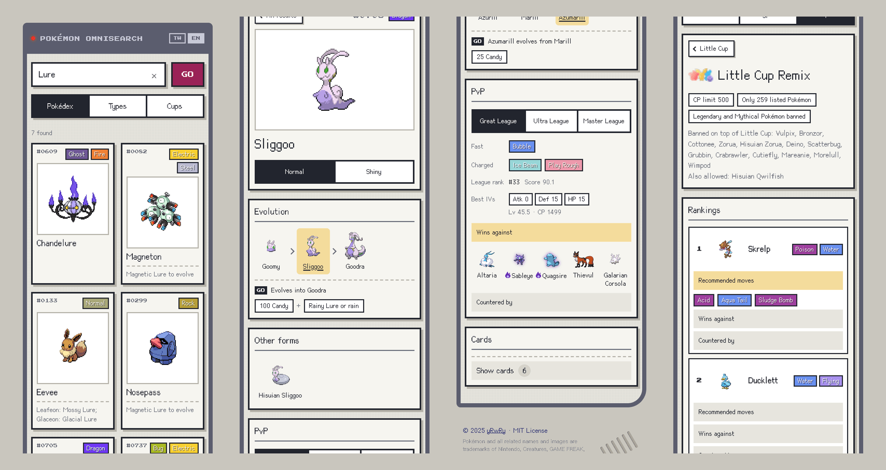
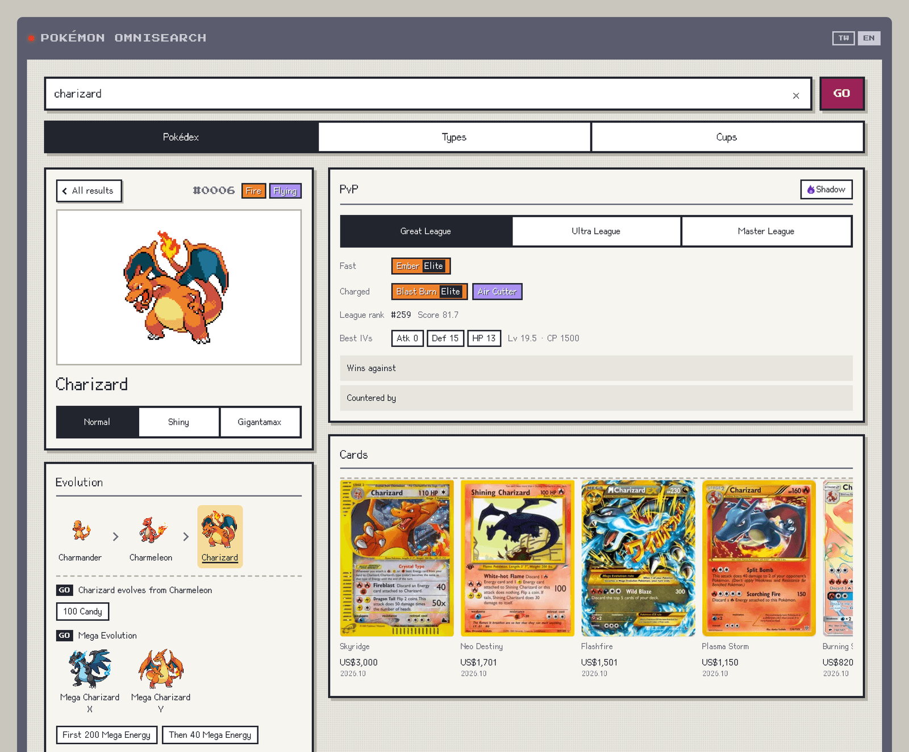

# POKÉMON OMNISEARCH

English | [繁體中文](README.zh-TW.md)



One search box for everything about a Pokémon: Pokémon GO evolution requirements, PvP moves and ranks, best IVs, GO Battle League cup rankings, Mega Evolution costs, form changes, and the trading cards it appears on.

Live: https://rrspw-oo.github.io/pokemon-dex/ (installable as an app on your phone)

## why

When I play Pokémon GO I end up with five tabs open for one Pokémon. One site for what it needs to evolve, another for its PvP moveset and rank, a calculator for IVs, a page for the current cup rules, and somewhere else again if I want to see its cards. Most of them only exist in one language, and none of them talk to each other.

So I pulled all of that together at build time and put it behind a single search box. Type a name, a dex number, a type, or even an evolution requirement like `catch dark` or `lure`, and everything about the Pokémon is on one page. The cards are extra: a quick look at which card styles a Pokémon has and which ones are worth a lot.

If this solves the same problem for you, a star helps. For collaboration, write to wpsrrr@gmail.com.



## what's in it

- **Search**: names in English and Traditional Chinese, dex numbers, types, regional forms, typo tolerance (`charzard`), and Pokémon GO evolution requirements (`catch dark`, `magnetic lure`, `walk`). All 1217 records are searched in the browser in under 5 ms, no server.
- **Evolution**: the full chain with the Pokémon GO requirement for each step: Candy, items, Lure Modules, buddy distance, hearts, quests, time of day, gender, trade discounts. 478 evolution targets from the game master, including regional variants with different requirements.
- **Mega Evolution and form changes**: all 61 Mega and Primal forms with Mega Energy costs, and form changes (Hoopa, Kyurem, Necrozma, Zygarde and more) with their Candy, Stardust and move requirements.
- **PvP**: recommended fast and charged moves (Elite TM marked), league rank and score, best stat-product IVs under the CP cap, and the opponents it beats and loses to, for Great, Ultra and Master League, normal and Shadow.
- **Types**: the strongest Pokémon of a type or type pair in each league.
- **Cups**: all 58 GO Battle League cups with their official icons, rules, Remix differences and a top 30 with moves, matchups and counters. Mega Edition cups show the Mega CP before and after evolving.
- **Cards**: up to 12 special or valuable trading cards per Pokémon (English and Traditional Chinese), with TCGplayer prices for cards worth US$100 or more.
- **Two languages**: a TW / EN switch. The English interface shows no Chinese at all; names, moves, requirements and cup rules come from the official Pokémon GO English text.
- **PWA**: works offline for anything you have already looked at, and updates itself.

## quick start

```bash
npm install
npm run dev
```

```bash
npm run build
npm run lint
```

## data

Everything the app shows is generated into `src/data/` by the scripts in `scripts/`. Nothing is fetched from these APIs at runtime except sprites and card images.

| script | output | sources |
| --- | --- | --- |
| `npm run data:evolutions` | `evolution_chains.json` | PokeAPI |
| `npm run data:forms` | forms, sprites, Mega records in `complete_pokemon_database.json` | PokeAPI, game master |
| `npm run data:go` | `go_evolutions.json`, `go_forms.json` | game master, official GO text (zh-TW, en) |
| `npm run data:pvp` | `pvp.json` | PvPoke, game master |
| `npm run data:cups` | `cups.json`, `public/cup-icons/` | game master, PvPoke |
| `npm run data:cards` | `cards.json` | TCGdex |
| `npm run data:fonts` | font subsets in `src/assets/fonts/` | the app's own text |

Run `data:forms` before `data:pvp`, `data:pvp` before `data:cups`, and `data:fonts` last. Downloads are cached in `node_modules/.cache/`; pass `-- --refresh` to fetch again.

## repo

```
scripts/              data and font generation
src/App.jsx           views, history, language
src/i18n.js           English strings and language state
src/components/       search, detail, PvP, types, cups, cards
src/services/         record to view model, lazy data loading
src/utils/            search index, IV math, type tables
src/data/             generated data
docs/ARCHITECTURE.md  how every part works, data formats, design rules
```

The detailed write-up of behavior, data formats and design decisions is in [docs/ARCHITECTURE.md](docs/ARCHITECTURE.md).

## built with

React 19, Vite 7, vite-plugin-pwa. Fonts: Cubic 11 and Press Start 2P (SIL OFL).

## acknowledgements

- [PokeAPI](https://pokeapi.co/) for species, forms and sprites
- [PvPoke](https://github.com/pvpoke/pvpoke) (MIT) for PvP rankings and movesets
- [PokeMiners](https://github.com/PokeMiners) for the Pokémon GO game master and text files
- [TCGdex](https://tcgdex.dev/) for trading card data, images through [wsrv.nl](https://wsrv.nl/)

## license

MIT, see [LICENSE](LICENSE). Images in `src/customContent/` are not covered. PvPoke data is MIT (`src/data/LICENSE-PvPoke.txt`); the fonts are SIL OFL (`src/assets/fonts/`).

Pokémon and all related names and images are trademarks of Nintendo, Creatures, GAME FREAK and The Pokémon Company. Pokémon GO game data and cup icons belong to Niantic. This is an unofficial fan project and is not affiliated with any of them.
